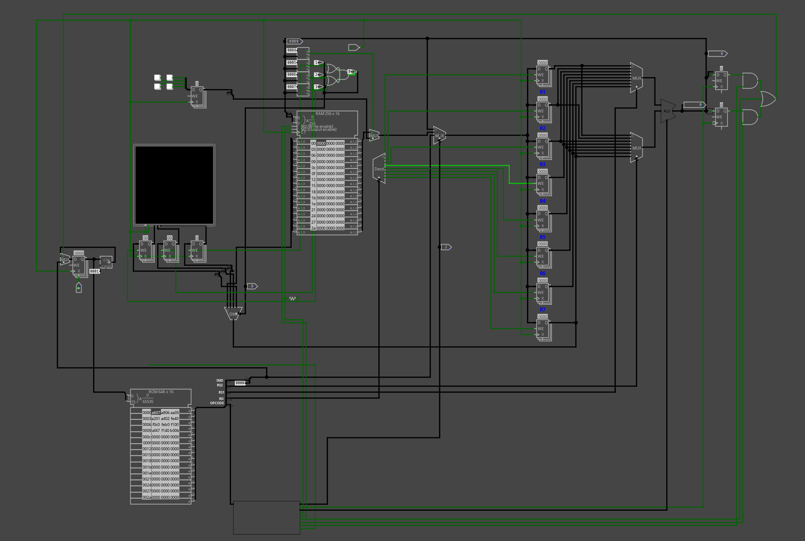
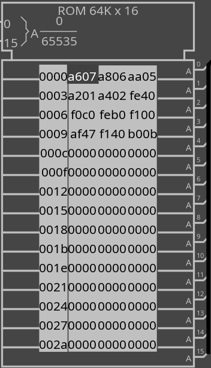
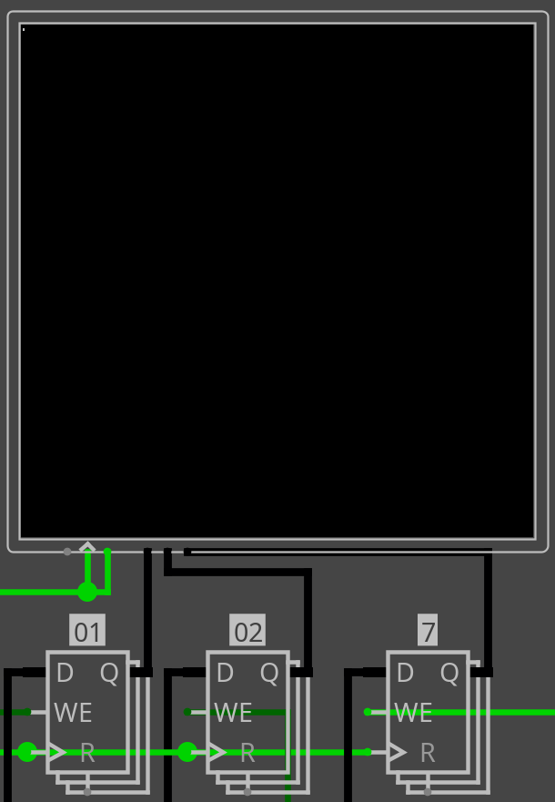
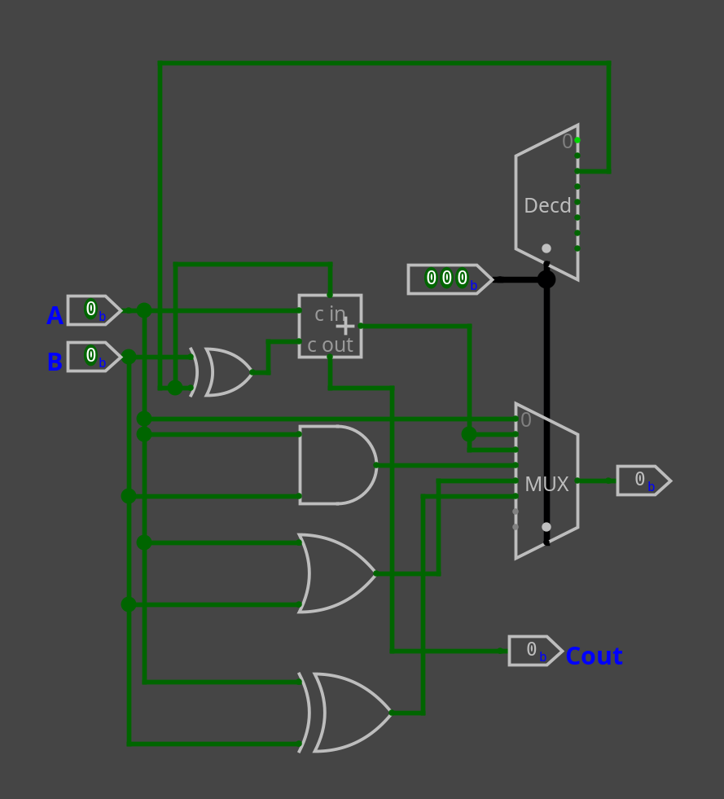
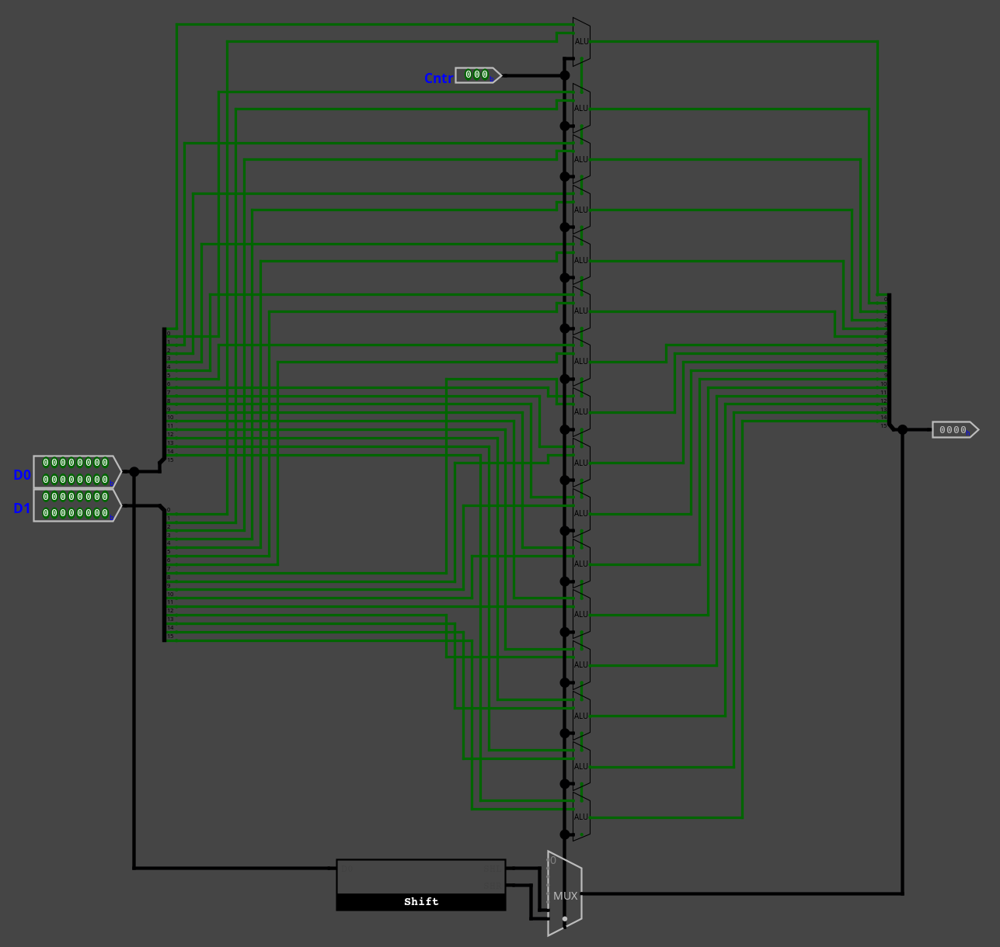
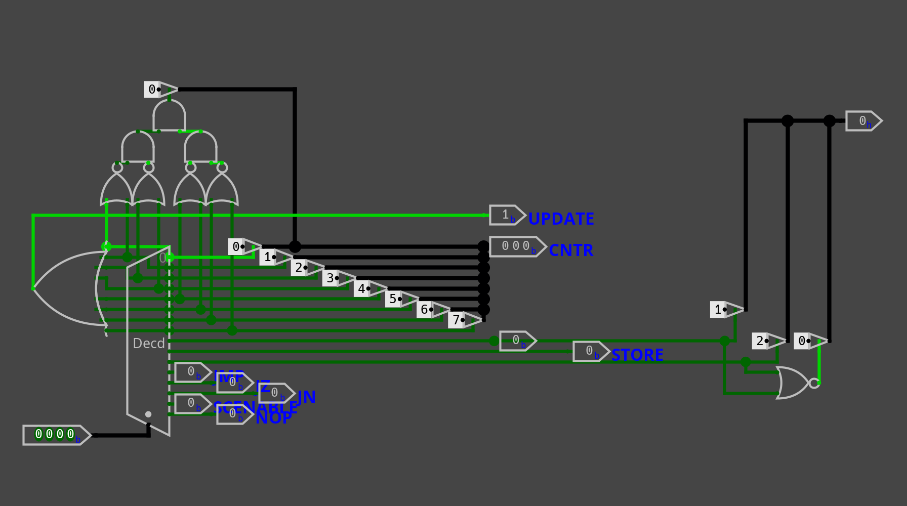

## 16-bit Custom CPU Project

### Overview
This project showcases a 16-bit CPU designed from scratch in Logisim. The CPU has a fully custom Instruction Set Architecture (ISA) built for a 32 bit long instruction. Allowing for complex programs, stretching from simple addition, to playing tetris. Additionally, a complementary custom python assembler was created in order to allow for quick and more readable programing of the CPU. Surrounding the CPU, ram is present, in order to increase the CPU's efficiency, allowing it to focus on computing difficult arithmetic.

---

### Design Goals
- Create a fully functional CPU capable of executing a simple program.  
- Implement a custom ISA including ADD, SUB, AND, OR, XOR, PASS/MOV, SHL, SHR, LOAD, STORE, JMP, JZ, and JN instructions.
- Implement a small pixel display system driven by memory-mapped registers, showcasing real-time CPU output.  
- Ensure modularity and clarity in design so the CPU can be easily extended or modified.  

---

### Currecnt Architecture (Current Version -V2)
- Is able to hold 32 unique 16bit values through its 32 registers.
- 32 bit instruction bit width to allow for a larger immediate.
- Ram address is controled via the ALU's output; the ram's data input is sent through register 2 (R2).
- Part of the ram also handles holding the screens current frame data, acting as a framebuffer.
- 

---

### Architecture

<i>Full CPU architecture showing registers, ALU, control unit, ROM, RAM, and screen registers.</i>

The CPU is composed of:

- **Registers (r0–r7)** – general-purpose registers, with r0 updating to ALU output by default unless another register is selected. r7 serves as the data register for screen output.  
- **ALU** – supports all arithmetic and logic operations, built from 1-bit slices, combined into a 16-bit ALU. Shifters are integrated to support shift operations efficiently.  
- **ROM** – stores program instructions in HEX, including the blinking pixel demo.  
- **RAM** – stores runtime data and can be memory-mapped to buttons or the display.  
- **Control Unit** – decodes instructions and generates signals for ALU, register writes, memory operations, and screen writes.  
- **Screen Registers / DMUX** – X, Y, and Color registers drive a 256×256 display; DMUX selects which value from r7 updates which register.

---

### Key Features

- **Custom ISA** with arithmetic, logic, shift, load/store, conditional and unconditional jumps, and memory-mapped display instructions.  
- **16-bit ALU** built from 1-bit slices; supports modular expansion.  
- **Screen system**: r3, r4, r5 hold X, Y, Color addresses; r7 holds data; DMUX selects the proper screen register; write-enable always active ensures stable frame updates.  
- **ROM-programmed demo**: a blinking pixel shows dynamic operation and the CPU’s ability to drive output in real time.  
- **Registers auto-update logic**: handles default r0 write while allowing r7 to hold screen data reliably.

---

### Design Components

#### ROM / Program

<i>ROM snippet of the blinking pixel demo program; instructions encoded using the custom ISA.</i>

- Program initializes screen registers and cycles through blinking a single pixel.  
- Demonstrates use of immediate values, ALU output, and memory-mapped addresses for screen control.

#### Display System

<i>Screen registers (X, Y, Color) and DMUX controlling the pixel output. r7 acts as the data register.</i>

- DMUX selects between RAM, X/Y/Color registers.  
- Comparator uses ALU output to select the proper screen register.  
- Display updates each clock cycle without timing issues, thanks to always-on write-enable.

#### ALU Design
<table>
<tr>
  <td></td>
  <td></td>
</tr>
</table>

<i>Left: 1-bit ALU slice showing basic operations. Right: Full 16-bit ALU with shifters for multi-bit operations.</i>

- 1-bit slice demonstrates fundamental logic.  
- Multi-bit ALU combines slices and integrates shifters for shift operations.

#### Control Unit

<i>Control unit decoding instructions and generating signals for ALU, registers, and screen writes.</i>

- Handles opcode decoding, register write selection, ALU inputs, memory operations, and screen writes.  
- Ensures instructions execute correctly while maintaining data stability for multi-cycle operations.

---

### Instruction Set Architecture (ISA)
The table below shows all function codes and corresponding opcodes used in the 16-bit CPU:

<table>
  <thead>
    <tr>
      <th>FUNC / Control</th>
      <th>Opcode (Binary)</th>
      <th>Description</th>
    </tr>
  </thead>
  <tbody>
    <tr><td>ADD</td><td>0000</td><td>Addition</td></tr>
    <tr><td>SUB</td><td>0001</td><td>Subtraction</td></tr>
    <tr><td>AND</td><td>0010</td><td>Logical AND</td></tr>
    <tr><td>OR</td><td>0011</td><td>Logical OR</td></tr>
    <tr><td>XOR</td><td>0100</td><td>Logical XOR</td></tr>
    <tr><td>PASS / MOV</td><td>0101</td><td>Pass/Move value</td></tr>
    <tr><td>SHL</td><td>0110</td><td>Shift Left</td></tr>
    <tr><td>SHR</td><td>0111</td><td>Shift Right</td></tr>
    <tr><td>LOAD</td><td>1000</td><td>Load from RAM / Buttons</td></tr>
    <tr><td>STORE</td><td>1001</td><td>Store to RAM</td></tr>
    <tr><td>SelectIMD</td><td>1010</td><td>Select Immediate input for register</td></tr>
    <tr><td>JMP</td><td>1011</td><td>Jump</td></tr>
    <tr><td>JZ</td><td>1100</td><td>Jump if Zero</td></tr>
    <tr><td>JN</td><td>1101</td><td>Jump if Negative</td></tr>
    <tr><td>ScreenWrite</td><td>1110</td><td>Write to Display Registers</td></tr>
    <tr><td>NOP</td><td>1111</td><td>No Operation</td></tr>
  </tbody>
</table>

<i>Complete instruction set for the 16-bit CPU, showing function, opcode, and operation.</i>

---

### Demo Video – Blinking Pixel

Click the image to watch the blinking pixel demo illustrating the CPU driving the screen registers and rendering output in real time.
The pixel is very small; it is located in the top left corner.

---

### Challenges & Solutions

- **Screen register timing**: originally, screen registers reset too quickly before a full frame could be written. Solved by connecting write-enable to the clock, ensuring stable updates.  
- **Propagation glitches in ALU output**: observed temporary incorrect values. Stabilized by holding r7 and carefully controlling ALU inputs.  
- **Encoding custom ISA into ROM**: manually translating instructions was error-prone; carefully verified HEX encoding for registers, immediate values, and opcodes.  

---

### Engineering Insight / Review

- This project demonstrates hardware-level design thinking, including modular ALU construction, control unit logic, and memory-mapped I/O.  
- Understanding how r0 default updates, r7 data routing, and DMUX selection interact was critical to correct screen output.  
- Emphasizes the importance of timing, signal propagation, and register latching in CPU design.

---

### Lessons Learned

- How to design a custom instruction set and encode it into ROM.  
- Multi-bit ALU design from 1-bit slices with integrated shifters.  
- Effective memory-mapped I/O and register selection for hardware-driven displays.  
- Debugging timing issues with registers, ALU, and output devices.  
- How to document and showcase engineering projects for both technical and non-technical audiences.

---

### CPU Documentation & Spreadsheet
For a detailed breakdown of all instruction encodings, register mappings, and control bits, see the full spreadsheet:

<a href="https://docs.google.com/spreadsheets/d/1kH7B6zKO7Dz-dAFfYohw4vK6F0j87CkjxfC4Pu1NQSY/edit?gid=0#gid=0" target="_blank">16-bit CPU ISA & Bit Mapping (Google Sheets)</a>
