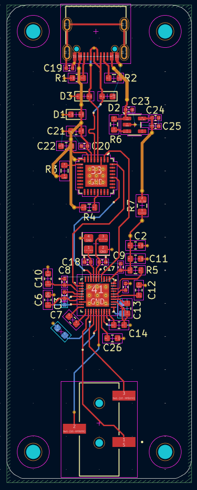
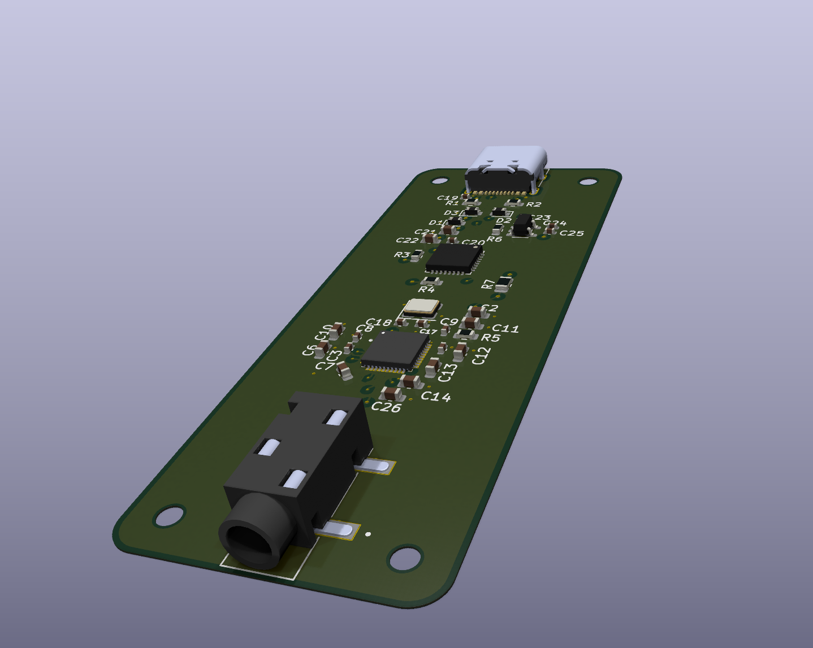
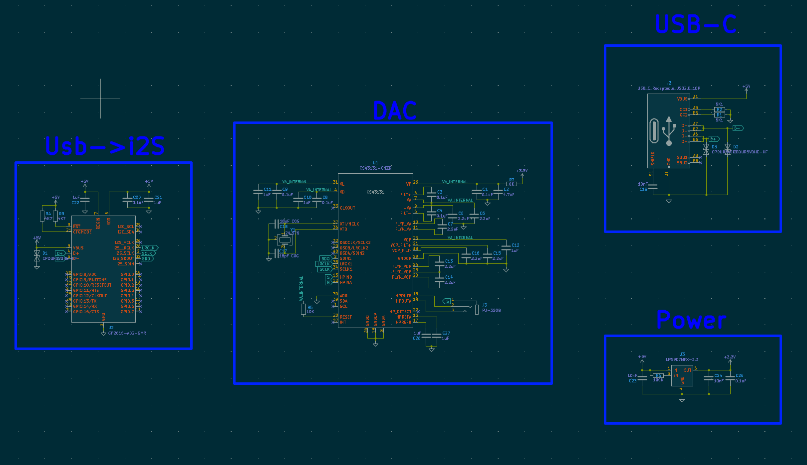

# Portable DAC Project – USB-C to Earbuds

## Overview
This project demonstrates a **high-fidelity portable DAC** designed to convert USB digital audio to analog output for earbuds. The design provides **clean, accurate audio** with careful attention to **analog/digital separation, power integrity, and component placement**.  

The DAC combines proven components and thoughtful engineering decisions to create a reliable, portable audio solution.

---

## Architecture / Components
- **DAC:** [CS43131-CNZR](https://www.cirrus.com/products/cs43131/) – high-resolution audio DAC capable of precise audio conversion.  
- **USB-to-I²S Bridge:** CP2615-A02-GMR – converts USB input to I²S digital audio. Older chip chosen intentionally due to **limited availability of newer USB-to-I²S bridges**, acknowledging coding and driver limitations as an engineer rather than a software developer.  
- **Power Supply:** LDO regulator for 3.3 V clean analog power, minimizing switching noise.  
- **Connectors:** USB-C input, 3.5 mm output jack.  
- **Crystal Oscillator:** 24.576 MHz with 18 pF load capacitors to stabilize DAC clock.  
- **Protection:** Avalanche diodes (CPDUR5V0HE-HF) on USB-C D+, D-, and VBUS lines for ESD protection.  
- **PCB:** 4-layer design  
  - Top layer: signal  
  - Layer 2: ground  
  - Layer 3: power  
  - Bottom layer: back signals and miscellaneous  

<i>Top view of the 4-layer PCB showing analog/digital separation and component placement.</i>

- **Physical Layout:** Long rectangular board to **physically separate analog and digital components** while keeping traces short.  
- **Decoupling:** 18 capacitors placed near ICs to maintain clean power.  
- **Test/Debug Resistors:** 0 Ω on VP pin for optional testing, 10 kΩ bias resistor on DAC.  
- **Minimum Trace Width:** 0.1 mm to keep cost low; smallest via 0.4 mm/0.2 mm.  
- **Component Sizes:** 0402 or larger for ease of manual assembly.  
- **Grounding:** Large copper pour for ground; no analog/digital split needed due to low current and single DAC.

---

## PCB Layout & Design Decisions
- **Trace-First, Cap-Second Routing:** Prioritized routing critical traces first, then placed decoupling capacitors as close as possible to reduce congestion around the DAC and crystal.  
- **Physical Separation:** Analog and digital sections on opposite ends of the board to reduce interference.  
- **Power Integrity:** LDO and careful decoupling ensure stable, low-noise analog supply.  
- **ESD Protection:** Avalanche diodes protect USB lines without impacting signal quality.  
- **Manual Assembly Considerations:** Components 0402+ and via sizes optimized for manufacturability.

<i>3D render of PCB layout showing components and assembly-friendly design.</i>

---

## Key Features
- **High-resolution audio** via CS43131 DAC.  
- USB-C input with CP2615 bridge for standard I²S audio.  
- Clean **LDO-based power** for minimal analog noise.  
- Thoughtful **PCB layout and component placement** to balance analog/digital separation and trace routing.  
- ESD protection via avalanche diodes on USB lines.  
- Design demonstrates **engineering judgment**, including understanding limitations in software/coding and choosing older, reliable components.

<i>KiCad schematic showing DAC, USB-to-I²S bridge, crystal oscillator, decoupling caps, and power connections.</i>

---

## Challenges & Solutions
- **Component Congestion:** Many decoupling capacitors and resistors near DAC made initial routing difficult. Resolved by routing traces first, then placing capacitors.  
- **Clock Stability:** Selected 18 pF capacitors on the 24.576 MHz crystal per DAC recommendations to ensure clean timing.  
- **Limited Chip Availability:** Used older USB-to-I²S chip intentionally to match existing knowledge and avoid unnecessary software complexity.  
- **Signal Separation:** Long rectangular PCB and careful placement reduced analog/digital interference.  
- **Assembly Constraints:** Component sizing and via selection simplified manual soldering and cost efficiency.
- **USB-C:** Impedence matching the USB-C connectors data lines presented to be very challenging. The data lines are required to be a specific width and distance from each other. However, the pins being on opposit sides from where they needed posed many issues. In order to fix this problem I placed the USB-C connector onto the back of the board there by flipping the pins.

---

## Engineering Insight / Review
- Demonstrates understanding of **analog design, signal integrity, and PCB layout strategy**.  
- Shows ability to **balance theoretical design with practical manufacturability**.  
- Reflects **engineering problem-solving skills**, including recognizing personal limitations in software development and adapting design choices accordingly.  
- Serves as a **foundation for further audio and analog projects**, bridging toward more complex domains like RF design.

---

## Lessons Learned
- **Routing first, placing capacitors second** is critical for dense analog/digital layouts.  
- LDO power and careful decoupling significantly improve analog signal quality.  
- ESD protection is important even for low-power circuits.  
- Planning layout for manufacturability avoids costly redesigns.  
- Understanding personal **software/coding limits** can inform smarter hardware and component choices.  
