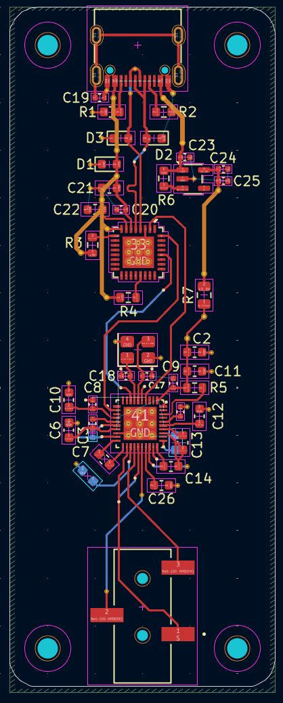
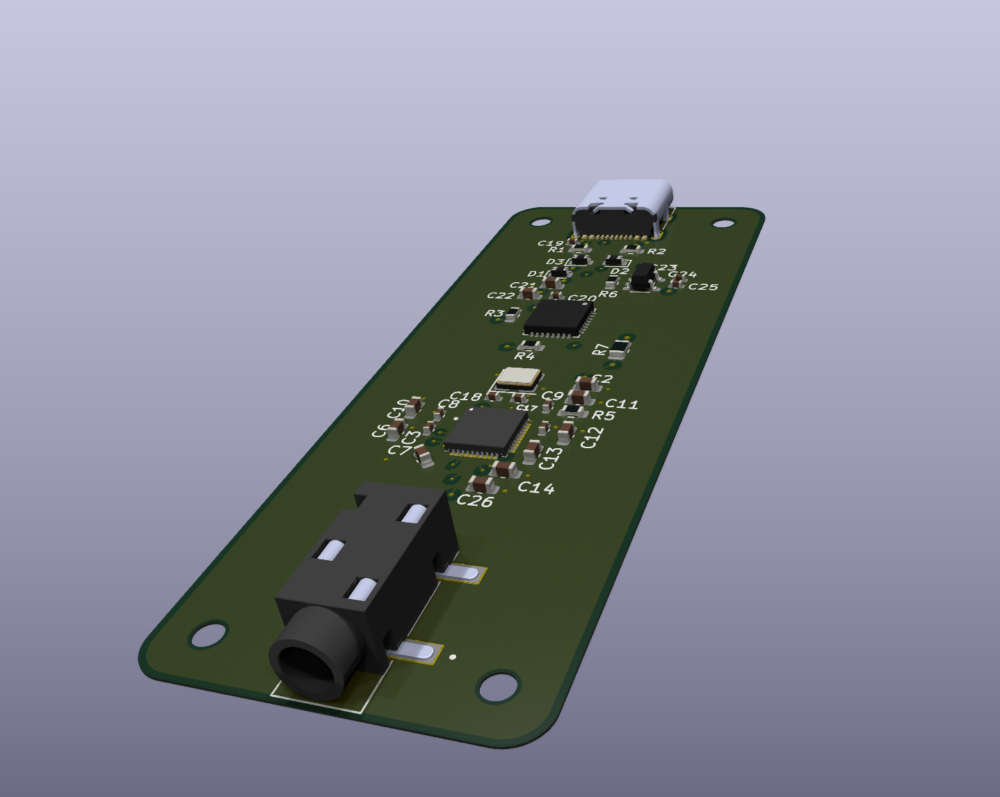
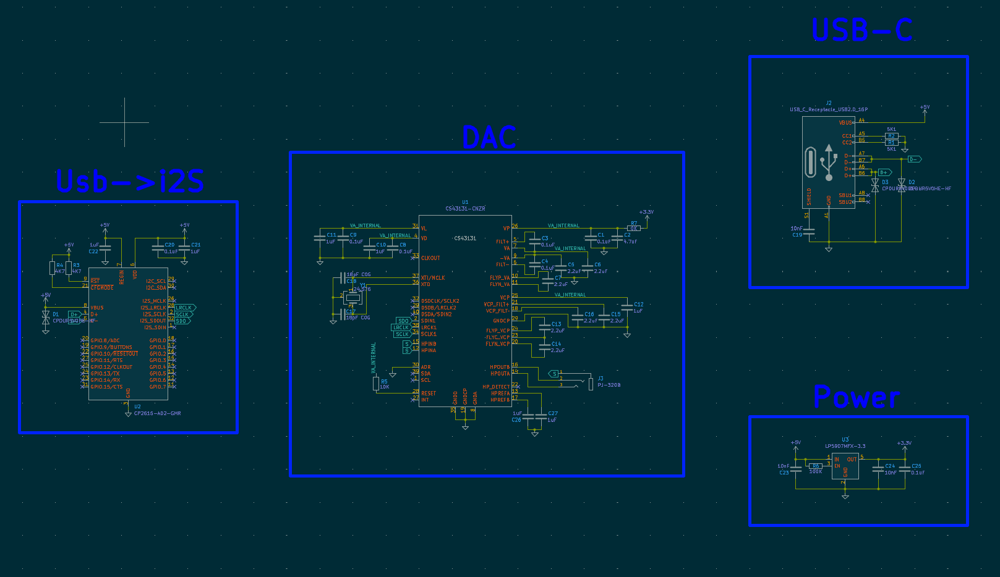

# Portable DAC Project – USB-C to Earbuds

## Overview
This project demonstrates a **high-fidelity portable DAC** designed to convert USB digital audio to an analog output for earbuds. The design provides **clean, accurate audio** with careful attention to **analog/digital separation, power integrity, and high-speed signal routing**.  

The DAC combines proven components and thoughtful engineering decisions to create a reliable, highly portable audio solution.

---

## Architecture / Components
- **DAC:** [CS43131-CNZR](https://www.cirrus.com/products/cs43131/) – high-resolution audio DAC capable of precise audio conversion.  
- **USB-to-I²S Bridge:** CP2615-A02-GMR – converts USB input to I²S digital audio. An older chip was chosen intentionally due to the **limited availability of newer standalone USB-to-I²S bridges**, acknowledging coding and driver limitations as a hardware engineer rather than a software developer.  
- **Power Supply:** Low-Dropout (LDO) regulator for 3.3 V clean analog power, minimizing switching noise.  
- **Connectors:** USB-C input (mounted on the bottom layer), 3.5 mm output jack.  
- **Crystal Oscillator:** 24.576 MHz with 18 pF load capacitors to stabilize the DAC master clock.  
- **Protection:** Low-capacitance avalanche diodes (CPDUR5V0HE-HF) on USB-C D+, D-, and VBUS lines for robust ESD protection without degrading high-speed data signals.  
- **PCB:** 4-layer design  
  - Top layer: Signal  
  - Layer 2: Ground  
  - Layer 3: Power  
  - Bottom layer: Back signals, USB-C connector, and miscellaneous routing  

<i>Top view of the 4-layer PCB showing analog/digital separation and component placement.</i>

- **Physical Layout:** Long rectangular board to **physically separate analog and digital components** while keeping trace lengths minimal.  
- **Decoupling:** 18 capacitors placed directly adjacent to IC power pins to maintain clean power rails.  
- **Test/Debug Resistors:** 0 Ω on the VP pin for optional testing, 10 kΩ bias resistor on the DAC.  
- **Minimum Trace Width:** 0.1 mm to optimize manufacturing costs; smallest via size is 0.4 mm/0.2 mm.  
- **Component Sizes:** 0402 or larger chosen intentionally for ease of manual assembly.  
- **Grounding:** Large unbroken copper pour for ground; no split analog/digital ground plane was necessary due to the low current draw and single-DAC configuration.

---

## PCB Layout & Design Decisions
- **Trace-First, Cap-Second Routing:** Prioritized routing critical high-speed and audio traces first, then placed decoupling capacitors as close as possible to the pins to reduce overall routing congestion around the DAC and crystal.  
- **Physical Separation:** Analog and digital sections are isolated on opposite ends of the board to prevent high-frequency digital noise from bleeding into the audio output.  
- **Power Integrity:** An independent LDO and localized decoupling loops ensure a stable, low-noise analog supply.  
- **ESD Protection:** Avalanche diodes safeguard the exposed USB-C data and power lines from electrostatic discharge.  
- **Manual Assembly Considerations:** Component sizing (0402+) and via geometries were optimized specifically for manual assembly and cost efficiency.

<i>3D render of the PCB layout showing components and assembly-friendly design layout.</i>

---

## Final Assembled Hardware
Below are the images of the final manufactured and hand-assembled hardware, featuring the bottom-mounted USB-C port and integrated ESD protection layout.

<i>Real-life top view of the assembled DAC board.</i>

<i>Real-life bottom view of the assembled DAC board, showcasing the inverted USB-C connector placement.</i>

---

## Key Features
- **High-resolution audio** via the dedicated CS43131 DAC.  
- USB-C input with a hardware-configured CP2615 bridge for plug-and-play I²S audio.  
- Clean **LDO-based power topology** for minimal analog noise floor.  
- Strategic **PCB layout and component placement** to maximize analog/digital isolation.  
- Integrated ESD protection via avalanche diodes on all external USB lines.  
- Design demonstrates practical **engineering judgment**, choosing reliable hardware solutions to balance complexity and constraints.

<i>KiCad schematic showing the DAC, USB-to-I²S bridge, crystal oscillator, decoupling network, and power rails.</i>

---

## Challenges & Solutions
- **Component Congestion:** Packing dense decoupling loops and configuration resistors near the fine-pitch DAC made initial routing incredibly tight. Resolved by executing trace infrastructure first, then fitting localized decoupling capacitors directly into the remaining space.  
- **Clock Stability:** Selected precise 18 pF load capacitors for the 24.576 MHz crystal matching the manufacturer's silicon specifications to guarantee stable clock edges.  
- **Limited Chip Availability:** Utilized an older-generation USB-to-I²S bridge intentionally to bypass the massive software overhead and firmware verification required by newer, un-configured chips.  
- **Signal Separation:** Implemented a long, linear rectangular PCB profile to enforce a natural physical separation between the digital input processing and sensitive analog output.  
- **USB-C Differential Pair Routing:** Impedance matching and routing the USB-C data lines presented a significant spatial challenge. Because the internal layer routing rules required a specific trace width and spacing, handling the cross-over from pins on opposite sides of the connector proved difficult. To resolve this cleanly without adding parasitic vias, the USB-C connector was flipped and mounted onto the **back (bottom) layer** of the PCB, allowing a direct, unhindered escape path for the differential signals.
- **Unconnected Ground Nodes (Manual Rework):** During the manual routing phase, a few critical ground connections were isolated. Specifically, several decoupling capacitor pads were missing ground vias, and the two primary ground pins of the bottom-mounted USB-C connector were left unrouted. To validate the hardware without scraping the board, manual rework was performed by soldering tiny magnetic jump wires directly from the isolated pads to the nearest verified system ground. These bodge wires are visible on the physical hardware assembly but successfully restored complete ground continuity for testing.

---

## Engineering Insight / Review
- Demonstrates practical understanding of **analog design, high-speed signal integrity, and PCB stackup strategy**.  
- Shows an advanced ability to **balance theoretical electrical design with real-world physical and manufacturing constraints**.  
- Reflects realistic **engineering problem-solving skills**, including analyzing hardware alternatives to abstract away unnecessary software complexity.  
- Serves as a strong **foundation for high-frequency design architectures**, bridging directly toward complex domains like RF microstrip engineering.

---

## Future Revisions
- Resolve all unrouted ground nodes identified in V1 by optimizing copper plane stitching and path connectivity.
- Transition to bare-metal embedded systems coding (such as STM32 or RP2040 architectures) to implement custom USB audio classes, eliminating the reliance on obsolete standalone bridge ICs.  
- Increase physical board real estate to expand the isolation trench between digital and analog ground fills.  
- Implement an active low-pass reconstruction filter stage between the DAC output and the 3.5 mm jack to further suppress high-frequency out-of-band noise.

---

## Lessons Learned
- **Run Design Rule Checks (DRC) Constantly:** Relying on visual inspection for dense layouts can result in isolated pads. Running the EDA tool's DRC engine repeatedly throughout the layout phase and immediately before exporting Gerber files is mandatory to catch unrouted nets.
- **Routing first, placing capacitors second** is an invaluable technique when managing dense, mixed-signal layouts.  
- Dedicating a layer to an unbroken ground plane directly beneath signal traces dramatically improves return paths and signal isolation.  
- Inverting component mounting planes (such as bottom-mounting a connector) is a highly effective layout tool to clean up complex pinout routing bottlenecks.  
- Designing proactively around your own assembly and software limitations results in functional hardware on the very first revision.
