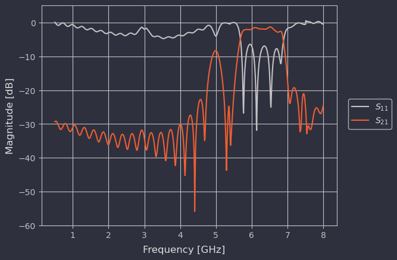
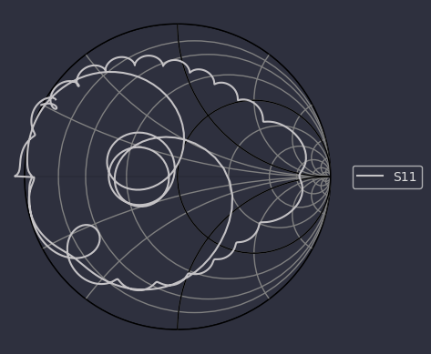

# 6 GHz Microstrip Bandpass Filter Prototype

This repository documents the design, optimization, and simulation iterations of a **6 GHz High-Q Microstrip Bandpass Filter** optimized for a high-performance 2-layer RF PCB prototype using a genuine **Rogers R4003C** core material.

The primary goal of this project is to develop a highly accurate virtual model of the filter to later compare against physical Vector Network Analyzer (VNA) measurements, analyzing how manufacturing tolerances map to numerical modeling data.

---

## Technical Specifications

| Parameter | Specification | Notes |
| :--- | :--- | :--- |
| **Center Frequency ($f_0$)** | 6.0 GHz | Target operational frequency |
| **Bandwidth (BW)** | 800 MHz | Full passband from 5.6 GHz to 6.4 GHz |
| **Passband Ripple** | < 0.5 dB | Optimized input tapping |
| **Substrate Core** | Rogers R4003C | Strict 0.254 mm (10 mil) thickness |
| **Dielectric Constant ($\epsilon_r$)** | 3.55 | Stable across high frequencies |
| **Loss Tangent ($\tan\delta$)** | 0.0027 | Ultra-low dissipation factor |
| **Layer Count** | 2 Layers | Solid back-side ground plane |
| **Copper Weight** | 1 oz (0.035 mm) | Finished top/bottom copper |

---

## Project Evolution & Design Philosophy

### Phase 1: The V1 Hybrid Stackup (Months 1–3)
The initial architecture of this filter was designed around a robust 4-layer hybrid stackup. This setup isolated the high-frequency microstrip elements on a top Rogers R4003C core while dropping down to standard FR4 prepreg layers below for structural rigidity and routing. 

The initial tuning phases captured the intense challenge of managing input impedance matching against tight resonance loops, as documented in the simulation plots below:

#### V1 S-Parameter Analysis ($S_{11}$ and $S_{21}$)
The insertion loss ($S_{21}$) demonstrates sharp roll-off characteristics bounding the 800 MHz wide passband. The return loss ($S_{11}$) maps the energy reflection across the full 500 MHz to 8 GHz sweep.

#### V1 Impedance & Smith Chart Matching
The input tap points on the outer resonator fingers transform the edge resonances directly into the center 50 $\Omega$ characteristic impedance locus of the network.

Upon generating production quotes for this layout, fabrication costs plummeted the project into a financial bottleneck—quoting out at over **$500** for a short prototype run. 

---

### Phase 2: The V2 Transition & OpenEMS Limitations (Month 4)
To drastically cut manufacturing overhead, the design was completely overhauled into a single-core, **2-layer microstrip configuration**. This stripped the design down to the core essentials:
* **Top Copper (L1):** Filter finger elements, coupled resonators, and 50 $\Omega$ feedlines.
* **Dielectric Core:** 0.254 mm (10 mil) Rogers R4003C core substrate.
* **Bottom Copper (L2):** Continuous, uninterrupted RF ground return plane.

Two weeks into testing the V2 stackup using **OpenEMS**, a fundamental algorithmic bottleneck appeared. OpenEMS relies on a Finite-Difference Time-Domain (FDTD) full-wave solver combined with a Fast Fourier Transform (FFT) to convert transient responses into frequency-domain S-parameters. Because of the exceptionally high-Q nature of this coupled-line filter, energy remained trapped within the resonator structures for an immense number of time-steps, causing truncation errors, numerical artifacts, and unreliable simulation curves.

### Phase 3: The Sonnet Lite Bottleneck (Month 5)
Seeking a solver better suited for planar circuits, the project transitioned to **Sonnet Lite**, a high-precision Method of Moments (MoM) planar EM simulator. This frequency-domain approach natively sidesteps the transient ringing issues found in FDTD. After a month spent mastering the geometry editor, port calibration, and boundary constraints, the design struck a licensing wall: the complex layout geometry and matrix sizes required for this filter exceeded the memory limits enforced by the Sonnet Lite license.

### Current Status
The project is actively undergoing evaluation for a new EM simulation platform capable of handling dense, high-Q microstrip features without restrictive cell capping or transient convergence failures.
