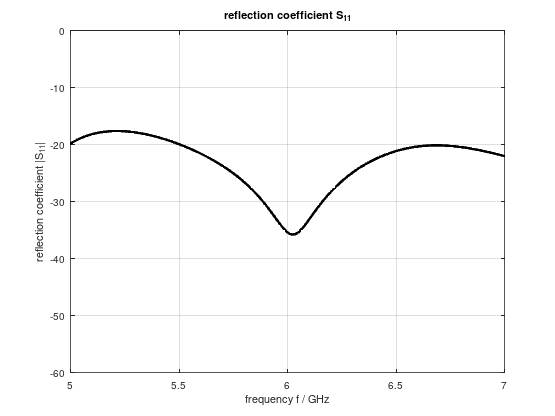
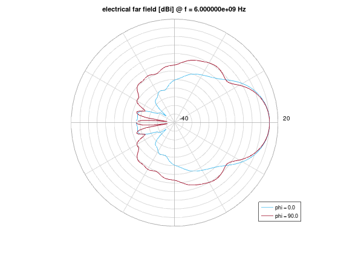
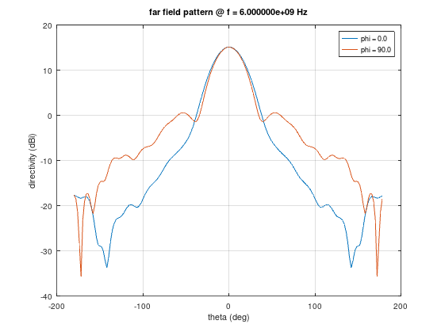
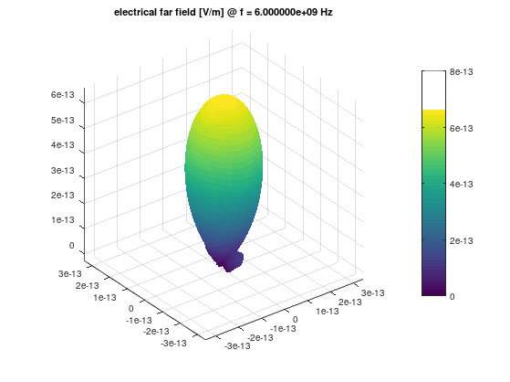
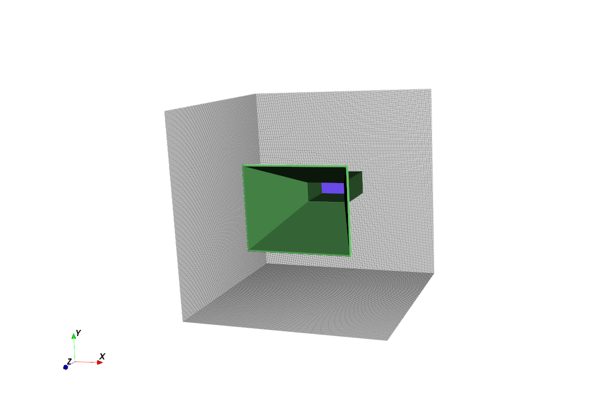

## Simulation Results

### S-Parameters

  

*Figure 1: Simulated S-parameter showing return loss near the target frequency.*

---

### 2D Radiation Patterns

  
  

*Figure 2: 2D far-field radiation characteristics of the antenna.*

---

### 3D Radiation Patterns

  
  

*Figure 3: 3D radiation pattern and simulation visualization.*

---

### Wave Propagation Visualization

A time-domain simulation showing electromagnetic wave propagation from the antenna at 6 GHz.

  

                                            Click to watch full video
  
*Figure 4: Electromagnetic wave propagation transitioning from near-field behavior to radiating far-field energy.*

---

This simulation illustrates how oscillating currents in the antenna generate coupled electric and magnetic fields, which propagate outward as electromagnetic radiation.
